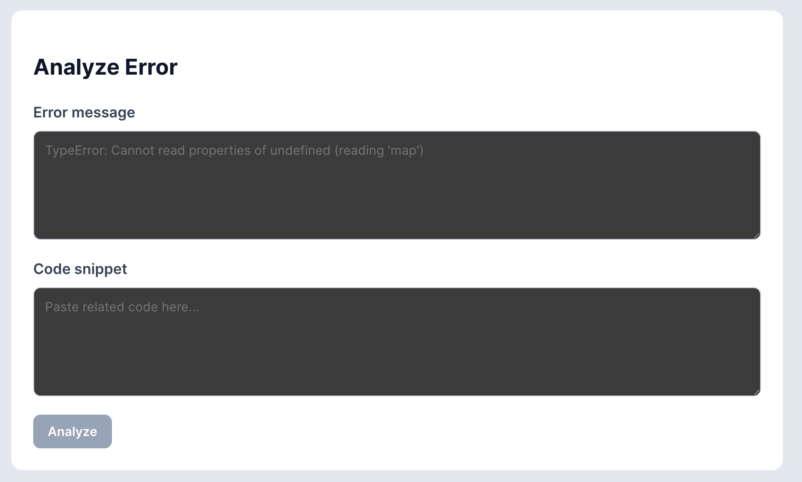
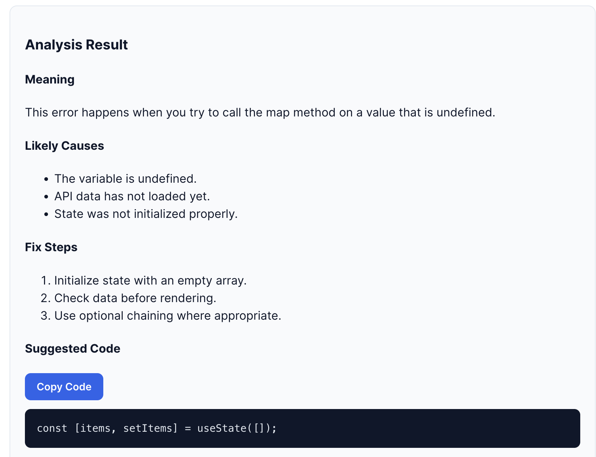

# AI Debug Assistant

## Overview

AI Debug Assistant is a full-stack web application that helps developers understand and troubleshoot coding errors more efficiently.

Users can submit an error message along with an optional code snippet, and the application provides:

- A plain-English explanation of the error
- Likely causes of the issue
- Suggested troubleshooting steps
- Related code examples to help resolve the problem

The project was built to explore AI integration in modern web applications while demonstrating full-stack development skills using React, TypeScript, Node.js, and REST APIs.

The application is designed for developers, students, and anyone debugging code who wants faster, AI-assisted troubleshooting and learning support.

---

## Features

- Submit error messages and optional code snippets
- AI-powered error analysis workflow
- Plain-English explanation of technical errors
- Suggested troubleshooting steps
- Suggested code examples related to identified errors
- Copy suggested code to clipboard
- Type-safe frontend and backend communication
- Service-layer architecture for API interactions
- Fallback response handling when AI services are unavailable

---

## Tech Stack

### Frontend

- React
- TypeScript
- Axios
- CSS

### Backend

- Node.js
- Express.js
- OpenAI SDK

### Development Tools

- Git
- GitHub
- Vite

### Architecture

- REST API communication
- Service-layer pattern
- Type-safe request and response contracts
- Environment-based configuration using `.env`

---

## Architecture

```text
React + TypeScript Frontend
            ↓
      Service Layer
            ↓
       Express API
            ↓
       OpenAI SDK
            ↓
      AI Response
            ↓
      Fallback Response
```

### Frontend

The frontend is built using React and TypeScript and provides a simple interface for submitting error messages and code snippets.

### Service Layer

API communication is centralized in a dedicated service layer to keep UI components focused on presentation and state management.

### Backend

The Express backend validates incoming requests, communicates with the AI provider, and returns structured responses to the frontend.

### Error Handling

If the AI provider is unavailable or returns an error, the application falls back to a predefined response to ensure the user experience remains uninterrupted.

---

## Screenshots

### Main Application



### Analysis Result



---

## Installation

### Clone Repository

```bash
git clone <your-repository-url>
cd ai-debug-assistant
```

### Backend Setup

```bash
cd server
npm install
```

Create a `.env` file:

```env
OPENAI_API_KEY=your_api_key
```

Start the backend:

```bash
npm run dev
```

### Frontend Setup

```bash
cd web
npm install
npm run dev
```

The frontend will be available at:

```text
http://localhost:5173
```

The backend will be available at:

```text
http://localhost:8080
```

---

## Future Improvements

- Real-time AI-powered debugging responses
- Support for multiple AI providers
- Error history and saved analyses
- Authentication and user accounts
- Syntax-highlighted code output
- Deployment to Vercel and Render
- Unit and integration testing
- Docker support

---

## Learnings

This project provided hands-on experience with:

- React and TypeScript development
- Express API design
- Service-layer architecture
- Environment variable management
- AI API integration
- Error handling and graceful fallback strategies
- Frontend and backend communication
- Building and structuring full-stack applications

```

```

Note: The backend includes OpenAI SDK integration and uses a fallback response when the AI provider is unavailable or quota is not configured.
